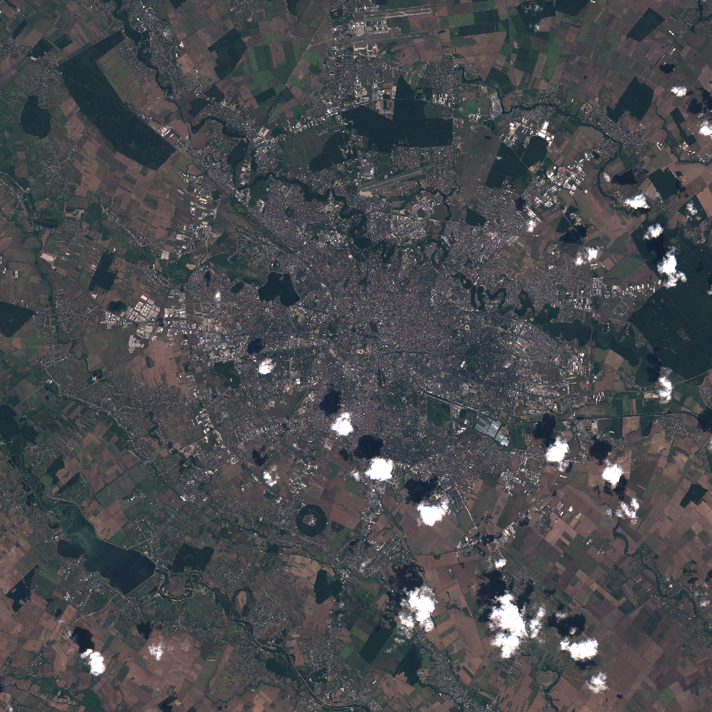
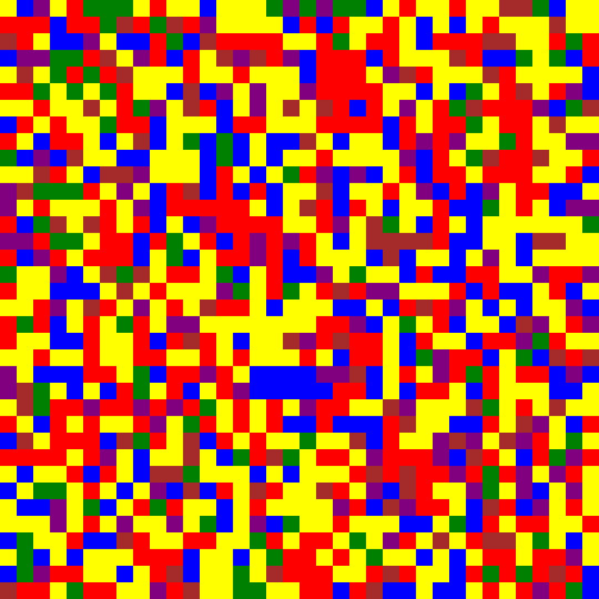

# Project Demo

## Input image (satellite image of Bucharest, RO from Sentinel 2 L1C)

## Output image

The colors should show what is on the land:
water - blue,
cultivated land - purple,
unused land - brown,
buildings/other man-made objects - red,
wheat - yellow,
forests - green,
solar panels - cyan,
clouds - white.
